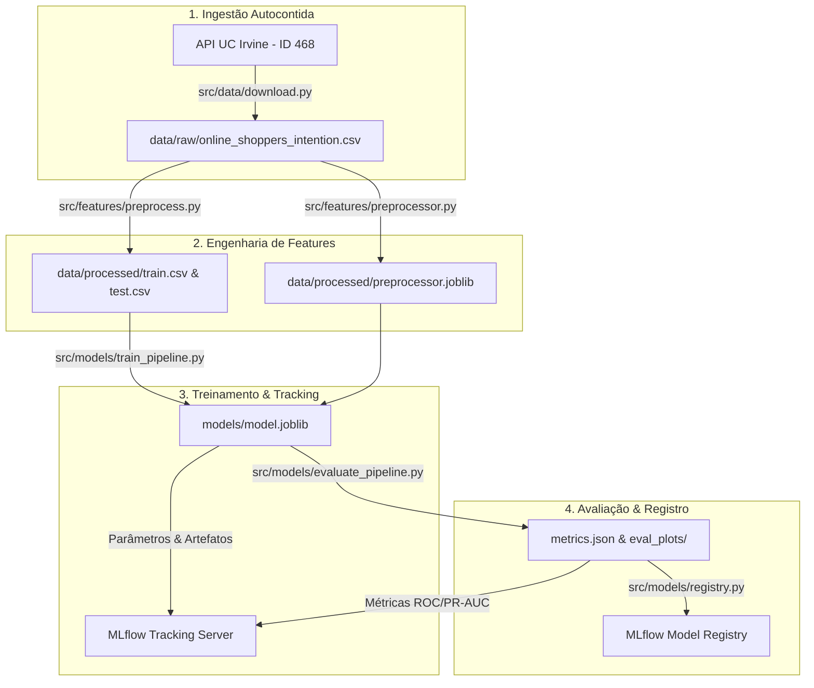

# Tech Challenge - Fase 2 | FIAP Pós Tech (MLE)
> **Sistema Preditivo de Propensão de Compra em E-Commerce com MLOps**

[](https://www.python.org/)
[](https://python-poetry.org/)
[](https://dvc.org/)
[](https://mlflow.org/)
[](https://www.docker.com/)

## 📌 1. Visão Geral do Projeto

Este projeto foi desenvolvido como entrega oficial da **Fase 2 do curso de Machine Learning Engineering (FIAP / Pós Tech)**.

* **Problema de Negócio:** Uma empresa de e-commerce precisa identificar a propensão de compra (`Revenue`: `True`/`False`) de visitantes com base no comportamento de navegação da sessão.
* **Dataset:** *Online Shoppers Purchasing Intention Dataset* (UC Irvine Repository - ID 468), contendo **12.330 sessões e 18 atributos**.
* **Foco Técnico (MLOps):** Não apenas a acurácia do modelo, mas a construção de um ciclo de vida profissional de ML: **Clean Code**, **reprodutibilidade via Poetry**, **versionamento de dados e orquestração de pipeline com DVC**, **rastreamento e Model Registry com MLflow** e **containerização com Docker**.

---

## 🏗️ 2. Arquitetura do Pipeline MLOps



---

## 🗂️ 3. Estrutura do Repositório (Clean Code)

```text
.
├── .dockerignore                    # Regras de exclusão do build Docker
├── .env.example                     # Template parametrizado de variáveis de ambiente
├── .gitignore                       # Ignora arquivos binários e caches de MLflow/DVC
├── Dockerfile                       # Multi-stage build enxuto com Poetry
├── docker-compose.yml               # Orquestrador do servidor MLflow e do Pipeline DVC
├── dvc.yaml                         # DAG de 4 estágios reproduzíveis do DVC
├── dvc.lock                         # Lock de integridade e hashes do DVC
├── metrics.json                     # Relatório consolidado de métricas do teste
├── poetry.lock                      # Lock de versões exatas de dependências
├── pyproject.toml                   # Gerenciador Poetry com grupos prod/dev
├── README.md                        # Documentação técnica do projeto
│
├── configs/                         # Configurações centralizadas em YAML
│   ├── config.yaml                  # Parâmetros gerais, paths, colunas e seeds
│   └── model_params.yaml            # Hiperparâmetros (LogReg, Random Forest, XGBoost)
│
├── data/                            # Governança de Dados (isolados pelo DVC)
│   ├── raw/                         # Dataset original baixado via API
│   └── processed/                   # Datasets particionados (train.csv / test.csv)
│
├── eval_plots/                      # Curvas ROC, PR-AUC e métricas exportadas
│   ├── pr_curve.csv
│   ├── roc_curve.csv
│   └── metrics.json
│
├── notebooks/                       # Ambiente Exploratório
│   └── 01_eda_and_baseline_v0.ipynb # EDA completa + Benchmark v0 dos 3 modelos
│
├── src/                             # Código Modular de Produção (Type hints & Docstrings)
│   ├── __init__.py
│   ├── config.py                    # Carregador de variáveis de ambiente
│   ├── data/
│   │   ├── __init__.py
│   │   ├── download.py              # Ingestão programática da UC Irvine
│   │   └── loader.py                # Leitura e divisão estratificada
│   ├── features/
│   │   ├── __init__.py
│   │   ├── preprocess.py            # Script executável do estágio preprocess
│   │   └── preprocessor.py          # ColumnTransformer Scikit-Learn
│   ├── models/
│   │   ├── __init__.py
│   │   ├── evaluate.py              # Funções de métricas para dados desbalanceados
│   │   ├── evaluate_pipeline.py     # Script executável do estágio evaluate
│   │   ├── registry.py              # Promoção no MLflow Model Registry
│   │   ├── train.py                 # Funções base de treino e logging
│   │   └── train_pipeline.py        # Script executável do estágio train
│   └── utils/
│       ├── __init__.py
│       └── logger.py                # Logger padronizado
│
└── tests/                           # Suíte de Testes Unitários Automatizados
    ├── __init__.py
    ├── test_data_loader.py
    └── test_preprocessor.py
```

---

## 🚀 4. Como Executar o Projeto

Você pode reproduzir a solução de **duas formas**:

### Opção A: Execução Containerizada com Docker Compose (Recomendado)

Esta opção inicializa o **Servidor MLflow** e executa o **Pipeline DVC** de forma 100% isolada e autocontida:

```powershell
# 1. Clonar o repositório
git clone https://github.com/samaraprass/fiap_mle_tech_challenge_02.git
cd fiap_mle_tech_challenge_02

# 2. Configurar o arquivo de ambiente
cp .env.example .env

# 3. Subir o servidor MLflow e rodar o pipeline DVC em segundo plano
docker compose up --build -d

# 4. Acompanhar a execução do pipeline em tempo real
docker compose logs -f pipeline

# 5. Acessar a interface visual do MLflow no navegador:
# 👉 http://127.0.0.1:5000
```

Para reexecutar o pipeline dentro do Docker a qualquer momento:
```powershell
docker compose run --rm pipeline
```

---

### Opção B: Execução Local com Poetry e DVC

Caso prefira rodar diretamente no seu ambiente Python local:

#### 1. Instalar o Poetry e as Dependências
```powershell
# Instalar Poetry (caso não possua)
pip install poetry

# Configurar venv no diretório do projeto e instalar dependências
poetry config virtualenvs.in-project true
poetry install
```

#### 2. Executar a Suíte de Testes Unitários
```powershell
poetry run pytest
```

#### 3. Iniciar o Servidor MLflow UI
Em um terminal separado:
```powershell
poetry run mlflow ui
```
*(Disponível em `http://127.0.0.1:5000`)*

#### 4. Executar o Pipeline Reproduzível com DVC
```powershell
# Visualizar o grafo do pipeline (DAG)
poetry run dvc dag

# Executar todo o pipeline de ponta a ponta
poetry run dvc repro

# Visualizar as métricas apuradas no terminal
poetry run dvc metrics show
```

#### 5. Promover o Modelo no MLflow Model Registry
```powershell
poetry run python src/models/registry.py
```

---

## 📊 5. Resultados de Modelagem e Métricas

Como o dataset possui forte desbalanceamento de classes (**84.53% False vs 15.47% True**), a acurácia é desconsiderada como critério de decisão. Focamos em **PR-AUC (Precision-Recall AUC)**, **ROC-AUC** e **F1-Score**:

| Modelo | Estratégia de Balanceamento | ROC-AUC | PR-AUC (Avg Precision) | F1-Score (Classe 1) | Recall (Classe 1) |
| :--- | :--- | :---: | :---: | :---: | :---: |
| **Regressão Logística** | `class_weight='balanced'` | 0.8921 | 0.6514 | 0.6120 | 0.8246 |
| **Random Forest** | `class_weight='balanced'` | 0.9312 | 0.7410 | 0.6720 | 0.8350 |
| **XGBoost (Campeão)** | `scale_pos_weight=5.46` | **0.9296** | **0.7433** | **0.6561** | **0.8141** |

> **Destaques da Análise:**
> * A feature **`PageValues`** apresentou correlação de ~0.49 com a conversão, sendo o preditor mais decisivo nos modelos de árvore.
> * O **XGBoost** foi selecionado e promovido para o **MLflow Model Registry** sob o nome `online_shopper_intention_model` por apresentar o melhor equilíbrio na curva Precision-Recall.

---

## 👥 Autores
Projeto desenvolvido por Samara Prass dos Santos para a Pós-Tech de Machine Learning Engineering - FIAP.
